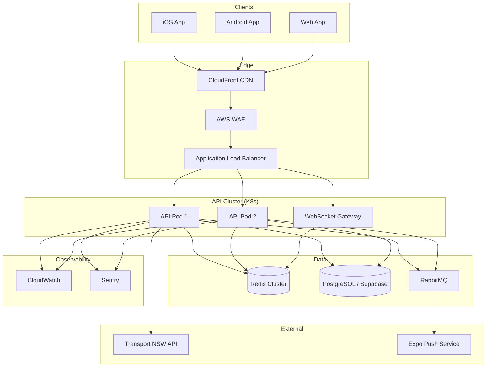

# TripView Sydney — Complete System Architecture

Production-grade real-time public transport platform for NSW (trains, buses, ferries, light rail).

---

## 1. Tech Stack

| Layer | Technology | Rationale |
|-------|-----------|-----------|
| **Backend** | Node.js 22 + Express | Fast I/O, shared JS with mobile, mature TfNSW integration |
| **Real-time** | WebSocket (`ws`) + SSE fallback | Sub-30s push updates; heartbeat + auto-reconnect |
| **Cache** | Redis (ioredis) + in-memory L1 | Rate-limit TfNSW; stale-while-revalidate |
| **Queue** | RabbitMQ | Alert fan-out, push notification workers |
| **Database** | PostgreSQL (Supabase) + SQLite (client) | Relational for users/favourites; offline on device |
| **API Gateway** | nginx / AWS ALB | TLS termination, rate limiting, WebSocket proxy |
| **Load Balancer** | AWS ALB / Azure Front Door | Health checks, sticky sessions for WS |
| **Cloud** | AWS (recommended) | Sydney region (`ap-southeast-2`), CloudFront CDN |
| **Mobile** | Expo React Native 56 | iOS + Android from one codebase |
| **Web** | Expo Web (Next.js optional) | Static export → nginx |
| **State** | Zustand + React Query | Persisted favourites; polled/cached API data |
| **Monitoring** | Sentry + CloudWatch | Errors, latency, TfNSW outage detection |

---

## 2. Backend Folder Structure

```
backend/
├── server.js                    # Entry point — mounts /api, /api/v1, /ws/v1
├── Dockerfile
├── package.json
├── admin/                       # Admin panel static assets
├── data/                        # TfNSW domain logic
│   ├── departuresService.js
│   ├── tripPlanner.js
│   ├── alertsService.js
│   ├── nearby.js
│   └── stationSearch.js
├── src/
│   ├── app.js                   # Modular app factory
│   ├── config/index.js
│   ├── controllers/
│   │   ├── auth.controller.js
│   │   ├── favourites.controller.js
│   │   ├── notifications.controller.js
│   │   └── realtime.controller.js
│   ├── middlewares/
│   │   ├── auth.js              # JWT + RBAC
│   │   ├── rateLimit.js
│   │   └── errorHandler.js
│   ├── routes/
│   │   ├── v1/index.js
│   │   ├── legacy.routes.js
│   │   ├── trip.routes.js
│   │   └── nearby.routes.js
│   ├── services/
│   │   ├── auth.service.js
│   │   ├── cache.service.js
│   │   ├── favourites.service.js
│   │   ├── notifications.service.js
│   │   └── tfnswIngestion.service.js
│   └── websocket/
│       └── gateway.js
├── tests/
│   ├── config.test.js
│   ├── auth.test.js
│   └── ingestion.test.js
└── scripts/
    └── sync-gtfs.mjs
```

---

## 3. Real-Time Data Pipeline

```
┌─────────────┐    poll 30s     ┌──────────────┐    cache 25s    ┌─────────────┐
│  TfNSW API  │ ──────────────► │ Ingestion    │ ──────────────► │ Redis L2    │
│ (departure_ │                 │ Service      │                 │ + Memory L1 │
│  mon, trip) │                 └──────┬───────┘                 └──────┬──────┘
└─────────────┘                        │                                │
                                       │ stale TTL 300s                 │
                                       ▼                                ▼
                              ┌────────────────┐              ┌─────────────────┐
                              │ Mock Fallback  │              │ WebSocket push  │
                              │ (outage mode)  │              │ departures.update│
                              └────────────────┘              └─────────────────┘
```

### Polling Strategy
- **Global poll gate**: `TFNSW_POLL_MS=30000` — one upstream call per station per window
- **Per-station cache**: `CACHE_TTL_SECONDS=25` fresh, `STALE_CACHE_TTL_SECONDS=300` stale
- **Rate-limit avoidance**: Redis dedup keys; batch popular stations; exponential backoff on 429

### Stale Data Handling
- Return cached data with `meta.stale: true` when TfNSW unreachable
- UI shows amber "Last updated X min ago" badge

### Outage Fallback
- `outageMode` flag set on consecutive failures
- Serve mock departures from `mockDepartures.js` with `meta.source: "mock-fallback"`

---

## 4. System Architecture



---

## 5. Database Design

**Recommendation: PostgreSQL (Supabase) + client SQLite**

| Why PostgreSQL | Why SQLite on client |
|----------------|---------------------|
| ACID for users, favourites, trips | Offline-first; no network required |
| RLS for multi-tenant security | Fast local reads for cached departures |
| JSONB for alert metadata | Sync on reconnect |

See `supabase/schema.sql` and `supabase/schema-extended.sql` for full DDL.

### ER Diagram (text)

```
users ──1:N── saved_stations ──N:1── stations
  │                                    │
  ├──1:N── saved_trips ──N:1───────────┤
  ├──1:N── notifications_config        │
  └──1:N── analytics_events            │
                                       │
routes ──1:N── route_stops ──N:1───────┘
       │
       └──1:N── timetables

vehicle_positions (partitioned by date)
alerts_cache
```

### Indexing Strategy
- `stations(mode, lat, lon)` — GiST for geo queries
- `saved_stations(user_id)` — favourites lookup
- `vehicle_positions(recorded_at)` — time-series partition
- `analytics_events(user_id, event_type, created_at)` — analytics

---

## 6. API Versioning

- **Legacy**: `/api/*` — used by current mobile app
- **v1**: `/api/v1/*` — versioned REST with JWT auth
- **WebSocket**: `/ws/v1` — real-time channel
- Header: `Accept: application/vnd.tripview.v1+json`
- Deprecation: 6-month sunset notice via `Sunset` response header

---

## 7. WebSocket Protocol

### Channels
| Event | Direction | Payload |
|-------|-----------|---------|
| `connected` | server→client | `{ clientId, heartbeatMs }` |
| `subscribe` | client→server | `{ stationIds: string[] }` |
| `subscribed` | server→client | `{ stationIds }` |
| `departures.update` | server→client | `{ stationId, departures[], meta }` |
| `ping` / `pong` | both | `{ ts: number }` |
| `alert.new` | server→client | `{ alert }` |
| `error` | server→client | `{ message }` |

### Reconnection Logic
1. Exponential backoff: 1s → 2s → 4s → 8s → max 30s
2. On reconnect: re-send `subscribe` with last station IDs
3. Heartbeat: respond to `ping` with `pong` within 5s

---

## 8. Security (OWASP API Top 10)

| Risk | Mitigation |
|------|-----------|
| Broken auth | JWT 15m + refresh 7d; bcrypt passwords |
| Broken authz | RBAC: `user`, `admin`; RLS on Supabase |
| Excessive data exposure | Field filtering; no password hashes in responses |
| Rate limiting | 120 req/min global; 10 req/min auth |
| Security misconfiguration | HTTPS only; secrets in AWS Secrets Manager |
| Injection | Parameterized queries; input validation |
| Improper asset management | Dependency audit in CI |
| Insufficient logging | Structured JSON logs; audit trail for auth |
| SSRF | Allowlist TfNSW domains only |
| Unsafe consumption | Validate TfNSW response schema |

---

## 9. Scalability

- **Horizontal scaling**: Stateless API pods behind ALB; Redis shared cache
- **DB sharding**: Partition `vehicle_positions` by date; read replicas for analytics
- **CDN**: Static web assets, station JSON bundles
- **Cold start**: Keep-warm Lambda not needed (always-on K8s pods)
- **Canary**: 5% traffic to new version via ALB weighted target groups

---

## 10. Testing Strategy

| Type | Tool | Location |
|------|------|----------|
| Unit | Node test runner | `backend/tests/` |
| Integration | Supertest + testcontainers | `backend/tests/integration/` |
| Load | k6 | `tests/load/` |
| Stress | k6 ramp | `tests/load/stress.js` |
| Chaos | Litmus (K8s) | `k8s/chaos/` |
| E2E | Detox (mobile) | `e2e/` |

---

## 11. Product Roadmap

### MVP (Current)
- [x] Real-time departures (TfNSW + mock fallback)
- [x] Timetables (next departures per stop)
- [x] Basic trip planner
- [x] Favourites (local Zustand + SQLite)
- [x] Service alerts
- [x] Nearby stops (GPS)

### Beta
- [x] WebSocket real-time push
- [ ] Push notifications (Expo Push)
- [x] Offline mode (SQLite cache)
- [ ] Analytics dashboard
- [ ] User accounts (Supabase Auth)

### Production
- [ ] Multi-city support (Melbourne, Brisbane GTFS)
- [ ] Advanced trip planner (arrive-by, accessibility)
- [ ] Full K8s deployment with auto-scaling
- [ ] Live vehicle map (GTFS-RT)
- [ ] Fare calculator

---

## Quick Start

```bash
# Development
npm install
npm run setup:env    # copy .env.example → .env, add TFNSW_API_KEY
npm run dev          # backend + Expo

# Full stack (Postgres + Redis + RabbitMQ)
docker compose -f docker-compose.full.yml up

# Production build
npm run build
docker compose up

# Kubernetes
kubectl apply -f k8s/namespace.yaml
kubectl apply -f k8s/
```
