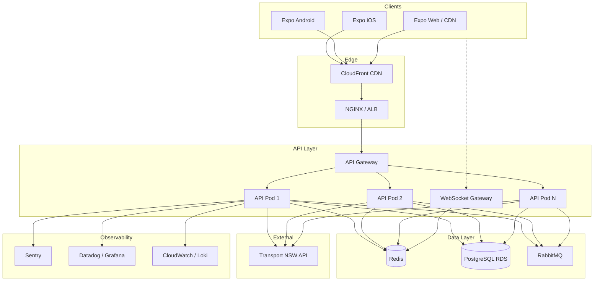

# TripView Platform — Complete System Specification

> Production-grade real-time public transport platform (Sydney / TfNSW).  
> **Stack:** Node.js · Express · WebSocket · Redis · PostgreSQL · RabbitMQ · Expo (iOS/Android/Web)

---

## 1. Project Description

TripView-style application delivering:

| Capability | Implementation |
|---|---|
| Real-time trains, buses, ferries, light rail | TfNSW API ingestion + WebSocket push |
| Timetables | `/api/v1/timetables` + SQLite offline cache (mobile) |
| Trip planning | `/api/v1/trip-planner` (TfNSW + mock fallback) |
| Favourites | Zustand + SQLite (local) + `/api/v1/favourites` (JWT sync) |
| Push notifications | Expo Push + `push_subscriptions` table |
| Offline mode | expo-sqlite + cached departures (`departureCache.ts`) |
| Multi-platform | Expo Router → iOS, Android, Web |
| High concurrency | HPA 3–20 pods, Redis cache, rate limiting |

---

## 2. Backend

### A. Tech Stack

```
┌─────────────────────────────────────────────────────────────┐
│  Cloud: AWS (recommended) — ECS/EKS, ElastiCache, RDS       │
│  Language: Node.js 22 LTS                                   │
│  Framework: Express.js (NestJS-ready modular /src layout)   │
│  Real-time: WebSocket (ws) at /ws/v1                        │
│  Cache: Redis (ioredis) — 25s TTL departures                │
│  Queue: RabbitMQ — alert fan-out, analytics (future)        │
│  API Gateway: NGINX Ingress (K8s) / ALB (AWS)               │
│  Load Balancer: K8s Service + HPA                           │
└─────────────────────────────────────────────────────────────┘
```

### B. Folder Structure

```
backend/
├── server.js                    # Entry — legacy /api/* + v1 mount
├── src/
│   ├── app.js                   # Standalone app factory
│   ├── config/index.js          # Env config
│   ├── controllers/
│   │   ├── auth.controller.js
│   │   ├── favourites.controller.js
│   │   └── realtime.controller.js
│   ├── middlewares/
│   │   ├── auth.js              # JWT + RBAC
│   │   ├── rateLimit.js         # IP throttling
│   │   └── errorHandler.js
│   ├── routes/
│   │   ├── v1/index.js          # Versioned router
│   │   ├── legacy.routes.js     # stops, routes, alerts
│   │   ├── trip.routes.js
│   │   └── nearby.routes.js
│   ├── services/
│   │   ├── auth.service.js
│   │   ├── cache.service.js     # Redis + memory fallback
│   │   ├── tfnswIngestion.service.js
│   │   └── favourites.service.js
│   ├── websocket/gateway.js     # Real-time push
│   └── utils/
├── data/                        # TfNSW adapters, mock data
├── tests/
└── scripts/
```

### C. Real-Time Data Pipeline

```mermaid
flowchart LR
  TfNSW[Transport NSW API] -->|poll 30s| Ingest[tfnswIngestion.service]
  Ingest --> Redis[(Redis 25s TTL)]
  Ingest --> Stale[Stale cache 300s]
  Redis --> REST[/api/v1/realtime]
  Redis --> WS[WebSocket gateway]
  WS --> Mobile[Expo App]
  REST --> Mobile
  Stale -->|outage| Mobile
  Mock[mockDepartures] -->|no key / outage| REST
```

**Polling strategy:** 30s per station batch; stagger requests 200ms apart to avoid burst rate limits.

**Rate-limit avoidance:** Cache-first reads; single poller per station key; exponential backoff on 429.

**Stale data:** Serve stale cache up to 300s with `meta.stale: true` header.

**Outage fallback:** `mock-fallback` itineraries + cached alerts; `outageMode` flag on `/api/v1/status`.

### D. Authentication

| Feature | Endpoint / Mechanism |
|---|---|
| Register | `POST /api/v1/auth/register` |
| Login | `POST /api/v1/auth/login` |
| Refresh | `POST /api/v1/auth/refresh` |
| Profile | `GET /api/v1/auth/me` (Bearer) |
| Roles | `user`, `admin`, `operator` via `requireRole()` |
| Rate limit | 10 auth requests/min/IP |
| Token storage (mobile) | SecureStore / Keychain (production) |

### E. Deployment

| Artifact | Path |
|---|---|
| Dockerfile | `backend/Dockerfile` |
| Docker Compose (API+Web) | `docker-compose.yml` |
| Full stack | `docker-compose.full.yml` |
| Kubernetes | `k8s/api-deployment.yaml`, `k8s/ingress.yaml` |
| CI/CD | `.github/workflows/ci.yml` |
| Canary | 10% traffic → 15min monitor → promote |

**Horizontal scaling:** HPA on CPU 70% / memory 80%, min 3 max 20 replicas.

---

## 3. API Endpoints (v1)

Base URL: `https://api.tripview.app/api/v1`  
Versioning: URL prefix `/api/v1`; legacy `/api/*` maintained for compatibility.

### Auth

**POST /auth/register**
```json
// Request
{ "email": "user@example.com", "password": "SecurePass123!", "displayName": "Alex" }
// Response 201
{ "user": { "id": "uuid", "email": "...", "role": "user" }, "accessToken": "eyJ...", "refreshToken": "eyJ...", "tokenType": "Bearer" }
// Errors: 409 EMAIL_EXISTS, 400 VALIDATION_ERROR
// Rate limit: 10/min
```

**POST /auth/login** — same response shape; 401 INVALID_CREDENTIALS.

**POST /auth/refresh**
```json
{ "refreshToken": "eyJ..." }
// Response: { "accessToken": "...", "refreshToken": "...", "tokenType": "Bearer" }
```

### Stops

**GET /stops?q=central**
```json
{ "stops": [{ "id": "CENTRAL_T", "name": "Central Station", "lat": -33.88, "lon": 151.21, "mode": "train" }], "version": "v1" }
```

**GET /stops/nearby?lat=-33.87&lng=151.21&radius=2000**

### Routes

**GET /routes** → `{ "routes": [...], "version": "v1" }`  
**GET /routes/:routeId/stops**

### Timetables / Real-time

**GET /timetables?stopId=CENTRAL_T**  
**GET /realtime/departures?stationId=CENTRAL_T**
```json
{
  "stationId": "CENTRAL_T",
  "departures": [{ "route": "T1", "destination": "Hornsby", "scheduledTime": "2026-05-30T08:15:00+10:00", "estimatedTime": "2026-05-30T08:17:00+10:00", "platform": "16", "isRealTime": true }],
  "meta": { "source": "transport.nsw.gov.au", "stale": false }
}
```

### Trip Planner

**GET /trip-planner?originId=CENTRAL_T&destinationId=TOWNHALL_T&departAt=2026-05-30T08:00:00+10:00**
```json
{
  "itineraries": [{
    "id": "real_trip_0_...",
    "totalDurationMinutes": 4,
    "departureTime": "2026-05-30T08:05:00+10:00",
    "arrivalTime": "2026-05-30T08:09:00+10:00",
    "transfersCount": 0,
    "legs": [{ "mode": "train", "routeNumber": "T2", "stops": ["Central", "Town Hall"] }]
  }],
  "version": "v1"
}
```

### Alerts

**GET /alerts?refresh=1**

### Favourites (JWT required)

**GET /favourites**  
**POST /favourites/stations** `{ "stationId", "stationName", "mode" }`  
**DELETE /favourites/stations/:stationId`  
**POST /favourites/trips** `{ "originId", "destinationId", "alias" }`

### Real-Time WebSocket

**URL:** `ws://localhost:3000/ws/v1`

| Event | Direction | Payload |
|---|---|---|
| `connected` | server→client | `{ clientId, heartbeatMs }` |
| `subscribe` | client→server | `{ stationIds: ["CENTRAL_T"] }` |
| `subscribed` | server→client | `{ stationIds }` |
| `departures.update` | server→client | `{ stationId, departures[] }` |
| `ping` / `pong` | both | `{ ts }` |
| `error` | server→client | `{ message }` |

**Reconnection:** Exponential backoff 1s→30s (`useRealtimeDepartures.ts`).

---

## 4. Database

### Recommendation: **PostgreSQL** (primary) + **Redis** (hot cache)

**Why PostgreSQL:** Relational joins (users ↔ favourites ↔ stops), ACID for auth, JSONB for alerts/settings, native partitioning for analytics and vehicle positions.

**Why Redis:** Sub-10ms departure reads at scale; pub/sub for WebSocket fan-out (future).

### ER Diagram

```
users ─────┬──── saved_stations ──── stops
           ├──── saved_trips ──────── stops (origin/dest)
           ├──── push_subscriptions
           └──── refresh_tokens

routes ──── route_stops ──── stops
routes ──── timetables ──── stops
routes ──── vehicle_positions (partitioned by recorded_at)
alerts (standalone)
analytics_events (partitioned)
audit_logs
```

Full schema: `database/migrations/001_tripview_schema.sql`

**Indexing:** B-tree on `stops(mode)`, `(lat,lon)`, `saved_stations(user_id)`, composite on `timetables(stop_id, day_type)`.

**Partitioning:** `vehicle_positions` and `analytics_events` by `recorded_at` (monthly partitions in production).

---

## 5. System Architecture



---

## 6. Frontend & Mobile

### Tech Stack

| Layer | Choice |
|---|---|
| Framework | Expo 56 + React Native 0.85 |
| Routing | Expo Router (file-based) |
| State | Zustand + React Query |
| Offline | expo-sqlite + AsyncStorage |
| Maps | react-native-maps |
| Styling | NativeWind (Tailwind) |

### Screens

| Screen | Path | Key Components |
|---|---|---|
| Home / Nearby | `(tabs)/nearby` | `NearbyDepartureCard`, `useNearbyStops` |
| Favourites | `(tabs)/favourites` | `LiveDepartureCard`, Zustand favourites |
| Journey | `(tabs)/journey` | `JourneyTimeline`, `useTripPlan` |
| Timetable | `(tabs)/timetable` | `TimetableView` |
| Station detail | `station/[id]` | Real-time board |
| Alerts | `alerts` | `useServiceAlerts` |
| Settings | `settings` | Offline toggle, notifications |
| Map | `map` | `TransitMap` |
| Assistant | `assistant` | AI live board |

### Component Structure

```
src/
├── app/              # Expo Router screens
├── components/
│   ├── design/       # Design system (Page, Chip, DepartureRow)
│   ├── ui/           # Cards, Skeleton, SearchBar
│   └── screens/      # TimetableView
├── hooks/            # useDepartures, useRealtimeDepartures
├── services/         # apiClient, tfnsw, dataService
├── store/            # Zustand global state
└── database/         # SQLite offline repository
```

### Loading / Error States

- `Skeleton.tsx` — shimmer placeholders
- `EmptyState.tsx` — no results
- `BackendStatusBadge.tsx` — API health indicator
- React Query `isLoading` / `isError` on all network hooks

---

## 7. Security (OWASP API Top 10)

| Risk | Mitigation |
|---|---|
| Broken auth | JWT + refresh rotation, bcrypt passwords |
| Broken authz | RBAC middleware, RLS in Supabase |
| Unrestricted resource consumption | Rate limiting 120/min, auth 10/min |
| Security misconfiguration | HTTPS only (Ingress TLS), secrets in K8s Secrets |
| Injection | Parameterized queries, input validation |
| Sensitive data exposure | No secrets in client; `.env.example` placeholders |
| SSRF | Allowlist TfNSW domain only |
| Audit | `audit_logs` table |
| Brute force | Failed login counter + account lockout (schema ready) |
| Abuse detection | IP throttling + anomaly alerts (Datadog) |

---

## 8. Scalability & Performance

| Strategy | Detail |
|---|---|
| Horizontal scaling | K8s HPA 3–20 pods |
| Caching | Redis 25s departures; CDN for static web |
| DB sharding | Read replicas for analytics; partition by date |
| Load balancing | Round-robin + sticky sessions for WebSocket |
| Queue processing | RabbitMQ for push notification batching |
| CDN | CloudFront for Expo web export |
| Cold start | Keep min 3 warm pods; Redis connection pool |

---

## 9. Testing

| Type | Location | Tool |
|---|---|---|
| Unit | `backend/tests/` | Node test runner |
| Integration | `backend/tests/` (future) | supertest |
| Load | `tests/load/k6-smoke.js` | k6 — 50 VUs, p95 < 500ms |
| Stress | CI manual gate | k6 500 VUs |
| Chaos | K8s pod kill | Litmus / manual |
| Dashboards | Grafana | API latency, cache hit rate, WS connections |

Run: `cd backend && npm test`  
Load: `k6 run tests/load/k6-smoke.js`

---

## 10. Product Roadmap

### MVP ✅ (Current)
- Real-time departures (TfNSW + mock)
- Timetables
- Basic trip planner
- Favourites (local + API)
- Nearby stops

### Beta 🔄
- Push notifications (schema + Expo Push wired)
- Offline mode (SQLite cache)
- Analytics events table
- JWT user accounts

### Production 🎯
- Multi-city (Melbourne PTV, Brisbane)
- Advanced trip planner (accessibility, bike+ride)
- Full K8s scaling + canary deploys
- Supabase auth sync

---

## 11. Quick Start

```bash
# 1. Install
npm install

# 2. Configure
npm run setup:env
# Edit .env — add TFNSW_API_KEY from opendata.transport.nsw.gov.au

# 3. Dev (API + Expo)
npm run dev

# 4. Full stack (Postgres + Redis)
docker compose -f docker-compose.full.yml up

# 5. Verify
curl http://localhost:3000/api/v1/status
curl http://localhost:3000/api/v1/stops?q=central
```

**WebSocket test:**
```javascript
const ws = new WebSocket('ws://localhost:3000/ws/v1');
ws.onmessage = (e) => console.log(JSON.parse(e.data));
ws.onopen = () => ws.send(JSON.stringify({ event: 'subscribe', payload: { stationIds: ['CENTRAL_T'] } }));
```

---

*Generated for TripView Sydney — production-ready modular architecture.*
